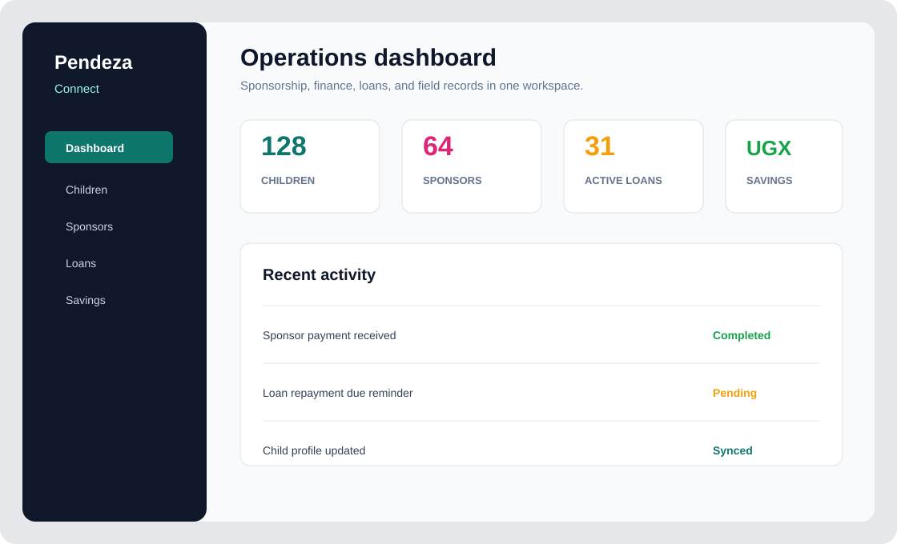
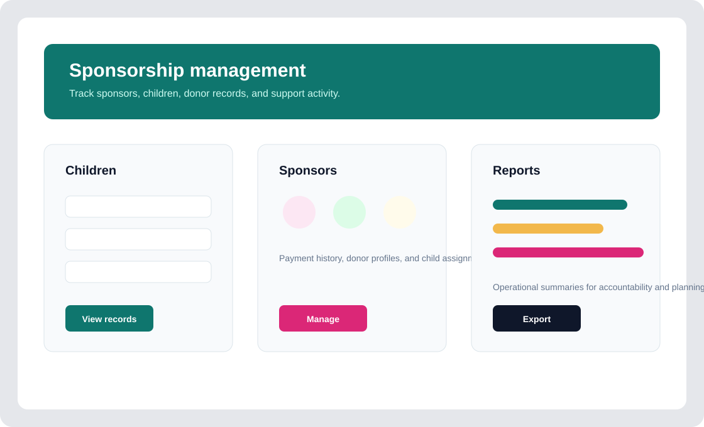
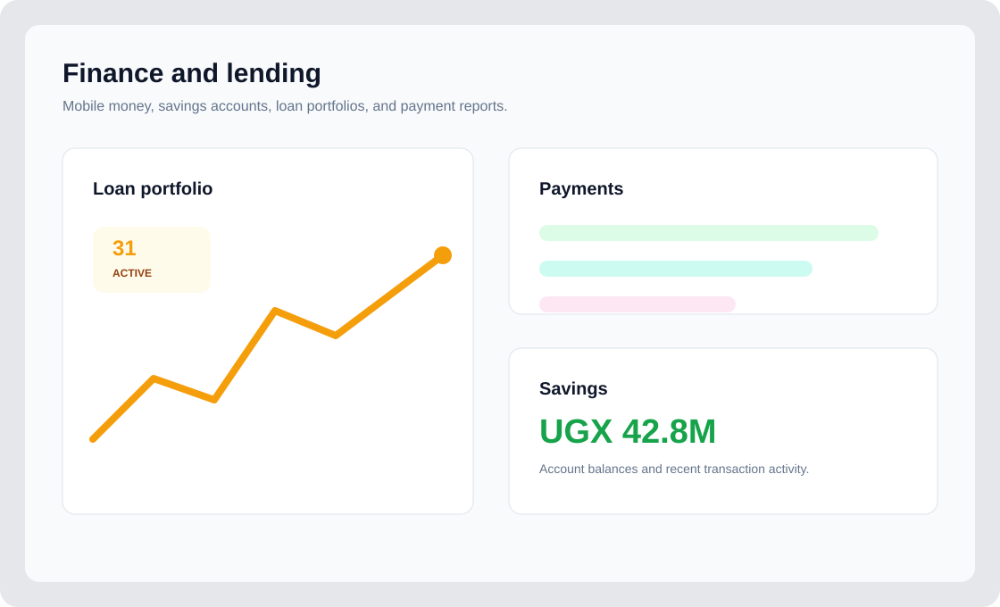

# Pendeza Connect Web

Pendeza Connect Web is the Django administration and operations platform for Pendeza Connect. It supports child sponsorship, sponsor and donor management, client records, staff records, loans, savings, payments, reports, and the mobile API used by the Pendeza Connect mobile app.


## Screenshots

| Dashboard | Sponsorship | Finance |
| --- | --- | --- |
|  |  |  |

## Highlights

- Central web dashboard for sponsorship, finance, loans, savings, staff, and child records.
- Child, sponsor, client, donor, and staff profile management.
- Sponsorship payment tracking, reports, and donor visibility.
- Loans module with applications, disbursements, repayments, arrears, penalties, and portfolio reports.
- Savings module with client accounts, balances, statements, and transaction history.
- MTN Mobile Money support for donation and payment workflows.
- Secure Django authentication with Google OAuth support.
- REST API endpoints for the Pendeza Connect mobile app.
- Production-oriented settings for Railway, PostgreSQL, static files, media storage, Celery, and Redis.

## Tech Stack

- Python 3.12
- Django 4.2
- Django REST Framework
- PostgreSQL
- Celery and Redis
- Bootstrap 5
- HTMX-enhanced templates
- Simple JWT for mobile API authentication
- Social Auth for Google OAuth

## Requirements

- Python 3.12
- PostgreSQL
- Redis
- Node is not required for the Django app runtime
- MTN MoMo credentials for payment integrations
- Google OAuth credentials for Google sign-in

## Environment

Create a local `.env` file and configure the values needed for your environment:

```env
DJANGO_ENV=development
SECRET_KEY=change-me
DEBUG=True

DB_NAME=pendeza_connect
DB_USER=postgres
DB_PASSWORD=
DB_HOST=localhost
DB_PORT=5432

REDIS_URL=redis://localhost:6379/0
CELERY_BROKER_URL=redis://localhost:6379/0
CELERY_RESULT_BACKEND=redis://localhost:6379/0

GOOGLE_KEY=
GOOGLE_SECRET=
MOBILE_GOOGLE_CLIENT_IDS=

DEFAULT_FROM_EMAIL=
EMAIL_HOST_USER=
EMAIL_HOST_PASSWORD=
```

For local Google OAuth, add this redirect URI in Google Cloud Console:

```text
http://localhost:8000/oauth/complete/google-oauth2/
```

For production, set `DJANGO_ENV=production` and configure `ALLOWED_HOSTS`, `CSRF_TRUSTED_ORIGINS`, database credentials, Redis, email, static/media storage, and payment credentials in the hosting environment.

## Installation

Create and activate a virtual environment:

```powershell
python -m venv .smsvenv
.\.smsvenv\Scripts\Activate.ps1
```

Install dependencies:

```powershell
python -m pip install --upgrade pip setuptools wheel
pip install -r requirements.txt
```

Apply migrations and create an admin user:

```powershell
python manage.py migrate
python manage.py createsuperuser
```

Run the development server:

```powershell
python manage.py runserver 0.0.0.0:8000
```

Open:

```text
http://localhost:8000
```

## Testing

Run the Django test suite:

```powershell
python manage.py test
```

Run a system check:

```powershell
python manage.py check
```

Coverage, when needed:

```powershell
coverage run manage.py test
coverage report -m
coverage html
```

## Mobile API

The mobile app uses the `/api/v1/` API surface for authentication, dashboards, children, clients, sponsors, staff, loans, payments, and savings.

Common mobile settings:

```text
Mobile API base URL: http://YOUR_HOST:8000/api/v1
Token refresh: /api/v1/auth/token/refresh/
Google login: /api/v1/auth/google/
```

The mobile Google sign-in flow sends Google access tokens to the API. Make sure `MOBILE_GOOGLE_CLIENT_IDS` or the Google client settings match the Firebase/Google project used by the mobile app.

## Project Structure

```text
api/                  Versioned REST API for mobile and integrations
apps/                 Django domain apps for users, child, sponsor, loans, savings, finance, reports, and inventory
core/                 Settings, URLs, ASGI/WSGI, Celery, and shared infrastructure
templates/            Server-rendered web UI
static/               CSS, JavaScript, images, and vendor assets
media/                Local uploaded media for development
docs/                 Project documentation and README screenshots
```

## Deployment Notes

- Use `core.settings.production` in production.
- Keep secrets in the hosting environment, not in source control.
- Run migrations before releasing a new version.
- Configure static files and media storage for production.
- Run Celery workers anywhere background jobs or scheduled notifications are required.
- Confirm payment callback URLs and Google OAuth redirect URIs match the deployed domain.

## License

This project is licensed under the MIT License.
